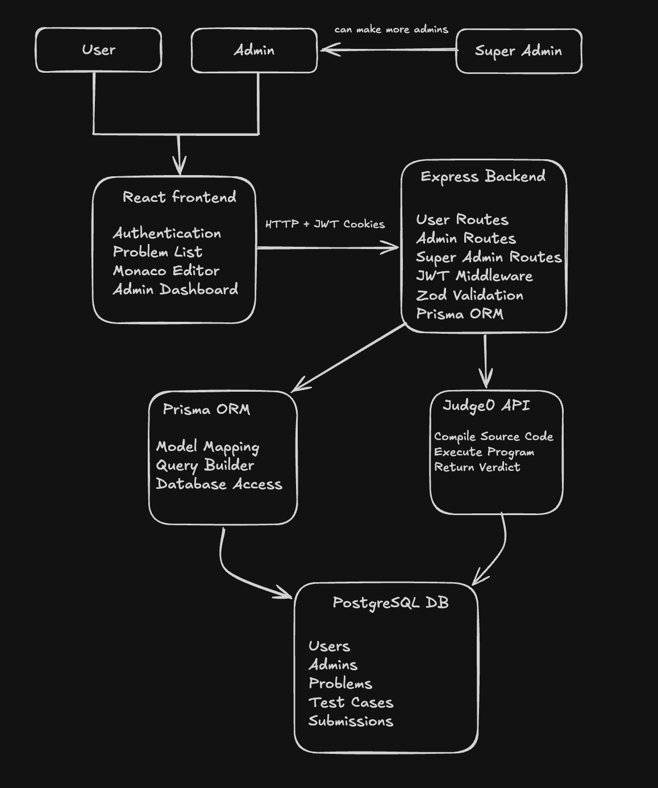

# 🚀 Cloud IDE

Cloud IDE is a full-stack online coding platform where users can solve coding problems, write code in an in-browser editor, and execute solutions using Judge0.

The platform includes a complete role-based administration system for managing coding problems and demonstrates a production-style full-stack architecture using React, Express, PostgreSQL, and Prisma.

---

# ✨ Features

## 👨‍💻 User Features

- Secure user authentication
- Browse coding problems
- Solve problems using the Monaco code editor
- Execute code using Judge0
- View execution results
- Responsive UI

---

## 🛠 Admin Features

- Secure admin login
- Create coding problems
- Modify existing problems
- Delete problems
- Toggle problem visibility
- Manage problem database

---

## 👑 Super Admin Features

- Secure super admin login
- Create administrator accounts
- Manage platform administrators

---

## 🔐 Authentication & Security

- JWT Authentication
- HTTP-only Cookies
- Role-Based Access Control (RBAC)
- Protected Routes
- Zod Request Validation

---

## ⚡ Code Execution

- Judge0 API Integration
- Multiple Programming Languages
- Compilation Output
- Runtime Error Handling
- Execution Status Polling

---

# 🛠 Tech Stack

### Frontend

- React
- TypeScript
- React Router
- Axios
- Monaco Editor
- Tailwind CSS
- shadcn/ui

### Backend

- Express.js
- TypeScript
- Prisma ORM
- JWT
- Zod

### Database

- PostgreSQL

### External Services

- Judge0 API

---

# 🏗 Architecture



---

# 📌 Project Workflow

### User

1. Sign Up / Sign In
2. Browse coding problems
3. Write code using Monaco Editor
4. Submit solution
5. Backend sends code to Judge0
6. Receive execution result

### Admin

1. Sign In
2. Create new problems
3. Edit existing problems
4. Delete problems
5. Manage visibility

### Super Admin

1. Sign In
2. Create administrator accounts

---

# 🚀 Getting Started

## Clone the repository

```bash
git clone <repository-url>
```

## Install dependencies

Frontend

```bash
cd frontend
npm install
```

Backend

```bash
cd backend
npm install
```

## Configure environment variables

Create a `.env` file in both frontend and backend.

## Run locally

Backend

```bash
npm run dev
```

Frontend

```bash
npm run dev
```

---

# 📈 Current Features

- ✅ JWT Authentication
- ✅ Role-Based Access Control
- ✅ User, Admin & Super Admin Roles
- ✅ Monaco Code Editor
- ✅ Judge0 Integration
- ✅ PostgreSQL Database
- ✅ Prisma ORM
- ✅ Problem Management
- ✅ Responsive UI
- ✅ Protected Routes

---

# 🚀 Future Improvements

- Hidden test case evaluation
- Batch Judge0 submissions
- Submission history
- Editorials
- Tags & filtering
- Contest mode
- Leaderboards
- User profiles
- Runtime & memory analytics

---

# 📄 License

This project is licensed under the MIT License.